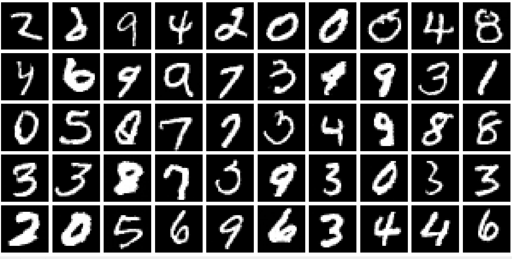
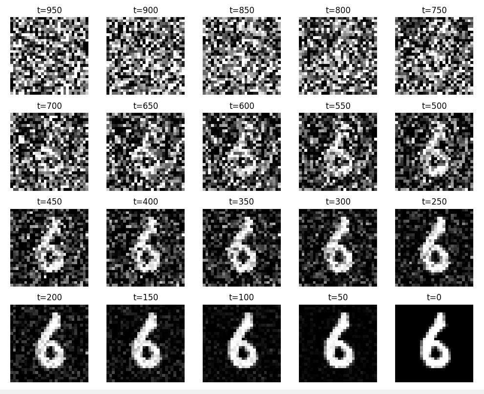

# 🧠 MNIST Diffusion U-Net

A **PyTorch implementation** of a U-Net–based **Denoising Diffusion Probabilistic Model (DDPM)** trained on the **MNIST** dataset.  
The model learns to generate handwritten digits from pure Gaussian noise by progressively denoising through learned diffusion steps.  

Inspired by the **“Denoising Diffusion Probabilistic Models” (Ho et al., 2020)** paper, this implementation adapts the DDPM framework with a compact U-Net architecture that achieves **high-quality digit generation results** on MNIST.

---

## Diffusion Results

The U-Net diffusion model was trained for **100 epochs** with a **batch size of 64** on the MNIST dataset.  
Below are digits generated by the model after training:

---

## 🔄 Diffusion Process

The diffusion model is trained with **1000 timesteps** to gradually denoise samples.  
The image below visualizes one example from **t=950 down to t=0** in a single snapshot:

> Each row in the image corresponds to a timestep, showing how the model progressively removes noise while reconstructing the digit.

---

## Features

- Custom **U-Net** architecture with residual blocks, group normalization, and SiLU activations  
- Integrated **timestep embeddings** for diffusion conditioning  
- **Self-attention layer** at mid-resolution for improved spatial coherence  
- Designed for **28×28 grayscale MNIST** images  
- Lightweight and modular — easy to extend for CIFAR-10 or other datasets  

---

## Model Architecture

The network follows a symmetric U-Net structure with residual and attention components:

| Stage | Details |
|--------|----------|
| **Input** | 1×28×28 noisy MNIST image |
| **Timestep Embedding** | **MLP timestep embeddings**: takes the time embedding vector and understands it, then passes it to the first residual block of each stage. |
| **Encoder Block 1** | Two residual blocks (1→16→16) with GroupNorm, downsample (28→14). The timestep embeddings are applied to the first residual block. |
| **Encoder Block 2** | Two residual blocks (32→32→32) with GroupNorm, downsample (14→7), self-attention. Timestep embeddings applied to the first residual block. |
| **Bottleneck** | Two residual blocks (64→64) with timestep embeddings applied to the first residual block. |
| **Decoder Block 1** | Upsample (7→14), concatenate skip connections, two residual blocks (64→32→32) with GroupNorm. Timestep embeddings applied to the first residual block. |
| **Decoder Block 2** | Upsample (14→28), concatenate skip connections, two residual blocks (32→16→16) with GroupNorm. Timestep embeddings applied to the first residual block. |
| **Output** | 1×1 convolution → reconstructed 28×28 denoised image |

Each residual block is **time-conditioned**, receiving the current diffusion timestep embedding to guide denoising.  
The self-attention module enhances mid-level spatial dependencies, leading to sharper digit reconstructions.  

This configuration achieved **visually consistent, clean, and diverse digits** after full training — demonstrating the effectiveness of diffusion learning even on small datasets like MNIST.

---

## Reference

- Ho et al., *Denoising Diffusion Probabilistic Models*, NeurIPS 2020  
  [https://arxiv.org/abs/2006.11239](https://arxiv.org/abs/2006.11239)
